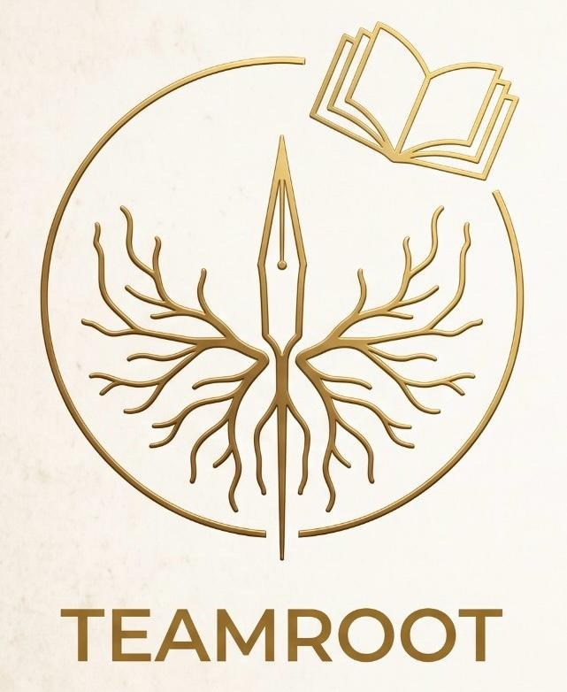

# 👨‍💻 Hola, soy Alejandro Limon 👨‍💻

  

Soy un **Estudiante en desarrollo de software** apasionado por la creación de aplicaciones eficientes y soluciones innovadoras. Mi enfoque principal es escribir código limpio, bien documentado y eficiente, con un fuerte énfasis en la calidad y el rendimiento.

## 🛠️ Tecnologías que manejo

### Lenguajes de programación:
- **C#**

### Herramientas y Frameworks:
- **Git / GitHub**
- **Unity**
- **Ubuntu**

### Otros:
- **Linux** (Ubuntu, Debian)
- **Scrum / Agile methodologies**
- **TDD (Test Driven Development)**

## 💼 Experiencia

### Participacion en la Global GameJam 2025
- Desarrollo de aplicaciones web utilizando **React** y **Node.js**.
- Diseño de bases de datos y optimización de consultas SQL.
- Implementación de pruebas automatizadas usando **Jest** y **Mocha**.
- Participación en el ciclo de vida completo del desarrollo de software desde la planificación hasta la implementación.

### Desarrollador Backend | [Empresa Y] | 2020 - 2022
- Creación de APIs RESTful en **Node.js** y **Express**.
- Integración con bases de datos **MongoDB** y **PostgreSQL**.
- Implementación de servicios en **AWS Lambda** para escalar aplicaciones sin servidor.

## 🚀 Proyectos Destacados

### [Proyecto 1](https://github.com/tuusuario/proyecto1)
- **Descripción**: Un sistema de gestión de tareas que permite a los usuarios crear, editar y eliminar tareas.
- **Tecnologías**: React, Node.js, MongoDB.
- **Enlace**: [Ver Proyecto en GitHub](https://github.com/tuusuario/proyecto1)

### [Proyecto 2](https://github.com/tuusuario/proyecto2)
- **Descripción**: Plataforma de comercio electrónico con funcionalidades avanzadas de búsqueda y filtrado.
- **Tecnologías**: JavaScript, Express, PostgreSQL.
- **Enlace**: [Ver Proyecto en GitHub](https://github.com/tuusuario/proyecto2)

## 📚 Educación

- **Licenciatura en Ciencias de la Computación** | Universidad XYZ | 2016 - 2020

## 📞 Contáctame

Puedes contactarme a través de los siguientes enlaces:

- [LinkedIn](https://www.linkedin.com/in/tuusuario)
- [Twitter](https://twitter.com/tuusuario)
- [Correo Electrónico](mailto:tu.email@dominio.com)

---

> "El código es como el humor. Cuando tienes que explicarlo, es malo." – *Cory House*

---

**Gracias por visitar mi perfil en GitHub!** 🚀

